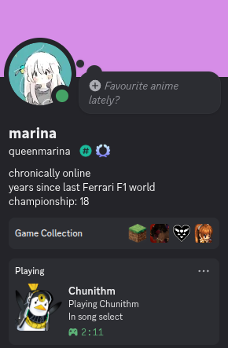
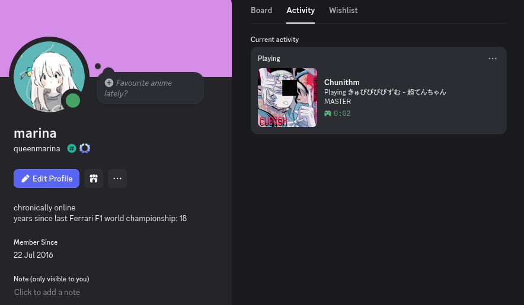

# ChuniRichPresence

ChuniRichPresence is a Discord Rich Presence connector for Chunithm.
It is built as an injectable DLL that you can add to your `launch.bat`

## Preview

<p>
  
  
</p>

## Configuration (segatools.ini)

You can customize behavior in `segatools.ini` under the `[chunirichpresence]` section.

```ini
[chunirichpresence]
game_name=Chunithm
logo_url=https://chunithm.org/assets/logo.png
discord_app_id=1482780703128289493
```

Supported options:

- `game_name`: display name used in Discord Rich Presence.
- `logo_url`: default image used when not actively playing a song.
- `discord_app_id`: Discord application ID used for RPC.

If a value is missing, the built-in default is used.
You do not need to create a Discord app ID, you can use the provided one, but the option is provided if needed

## Build Instructions (Rust)

1. Install Rust using rustup:
   - https://rustup.rs
2. Add the target:
   - `rustup target add i686-pc-windows-msvc`
3. Build:
   - `cargo build --release --target i686-pc-windows-msvc`

Build output:

- `target/i686-pc-windows-msvc/release/chunirichpresence.dll`

## How to add

1. Copy `chunirichpresence.dll` to your game/launcher directory.
2. Edit your `launch.bat`.
3. Add this DLL to your injector command (same place you add other injected mods).

Example with `inject.exe`:

```bat
inject_x86 -d -k chusanhook_x86.dll -k chunirichpresence.dll chusanApp.exe
```

If your `launch.bat` already injects DLLs, append `chunirichpresence.dll` to that existing list.

## Logging

Debug logs are only written when `CHUNIRICHPRESENCE_DEBUG` is enabled.

- `launch.bat` example:
  `set CHUNIRICHPRESENCE_DEBUG=1`

When enabled, logs are written to `chunirichpresence.log` next to `chunirichpresence.dll`

## Testing

This has been tested with Chunithm XVERSE Final on Windows 10.

## Disclaimer

Partially coded with ChatGPT Codex
